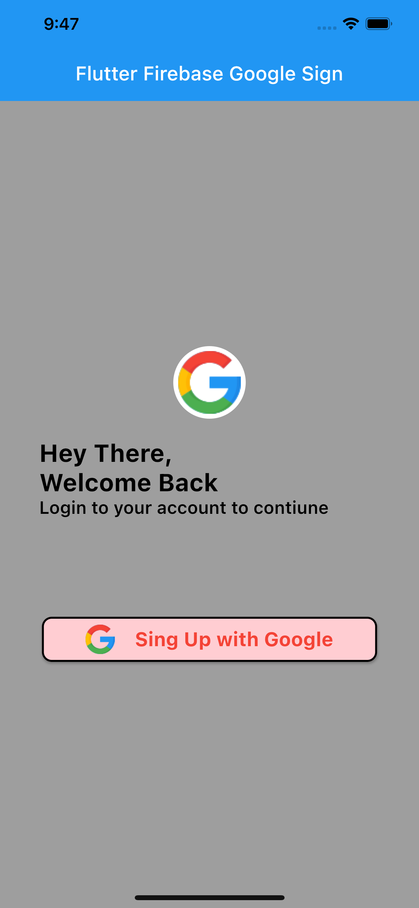
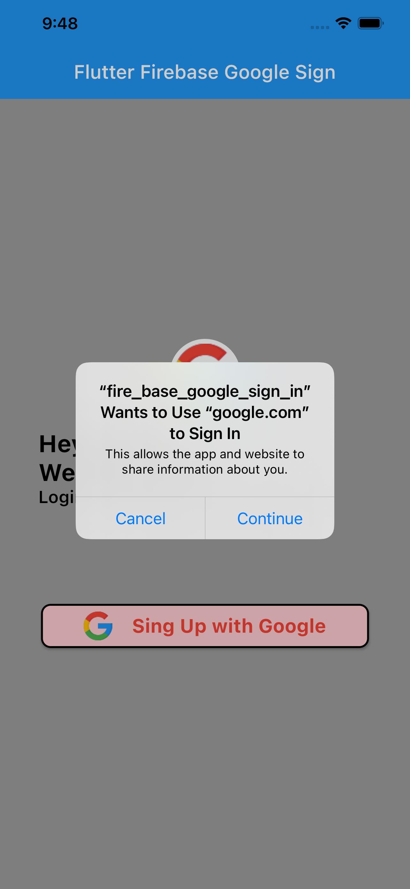
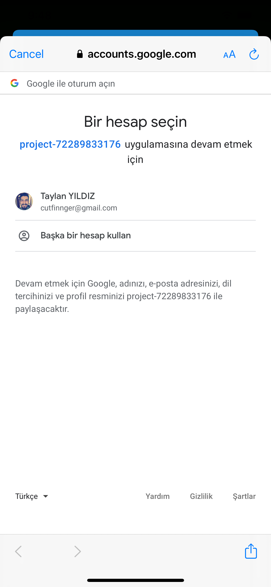
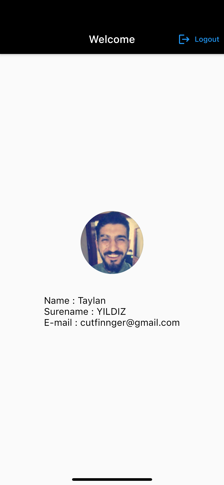
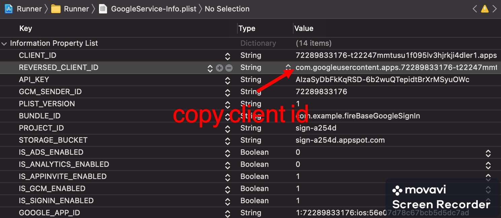
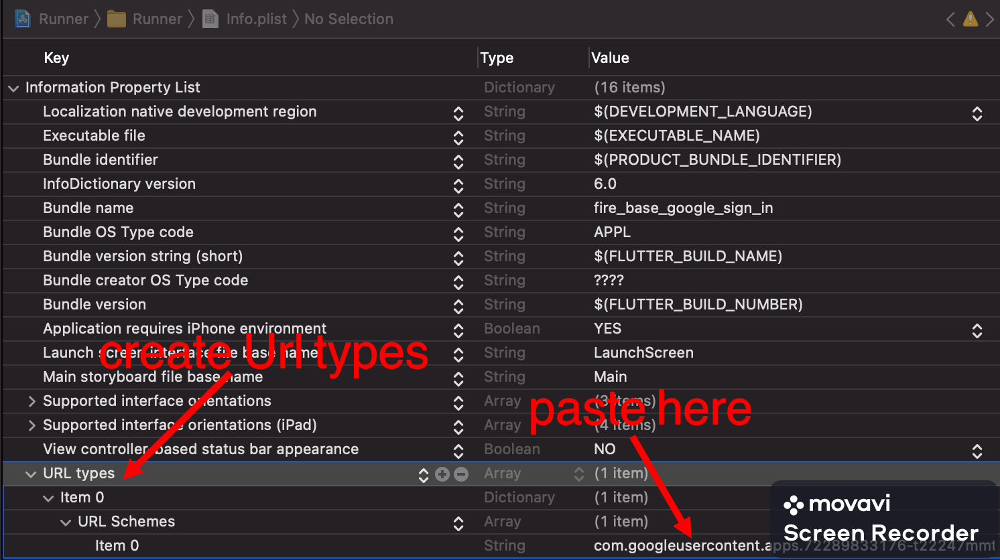

# fire_base_google_sign_in

Ios Firebase Google Sign-In

### pubspec.yaml
```yaml
  #State Management
  provider:
  #Firebase Auth
  firebase_core:
  firebase_auth:
  #Google Sign
  google_sign_in:
```

|              App Account             |          App Permission              |          App Google Account          |            App Logged             | 
| :----------------------------------: | :----------------------------------: | :----------------------------------: | :----------------------------------: |
| <a  target="_blank"></a> | <a  target="_blank"></a> |  <a  target="_blank"></a> |  <a  target="_blank"></a> |

# XCode
## GoogleService-Info.plist



## Info.plist
 

## Podfile
 - platform :ios, '10.0'

## Service 

- Usage ChangeNotifier

```dart
class GoogleSignService with ChangeNotifier {
  GoogleSignInAccount? _account;
  GoogleSignInAccount get user => _account!;
  Future<void> googleSign() async {
    try {
      final GoogleSignInAccount? googleUser = await GoogleSignIn().signIn();
      if (googleUser == null) return;
      _account = googleUser;
      final GoogleSignInAuthentication googleAuth =
          await googleUser.authentication;
      final credential = GoogleAuthProvider.credential(
        accessToken: googleAuth.accessToken,
        idToken: googleAuth.idToken,
      );
      await FirebaseAuth.instance.signInWithCredential(credential);
      notifyListeners();
    } catch (e) {
      log(e.toString());
    }
  }

  Future<void> googleLogOut() async {
    try {
      await GoogleSignIn().disconnect();
      FirebaseAuth.instance.signOut();
    } catch (e) {
      log(e.toString());
    }
  }
```

## Provider introduction to the application

```dart
    ChangeNotifierProvider(
      create: (_) => GoogleSignService(),
      child: MaterialApp(
        debugShowCheckedModeBanner: false,
        title: 'Flutter Firebase Google Sign',
        theme: ThemeData(
          primarySwatch: Colors.blue,
        ),
        home: HomeScreen(title: 'Flutter Firebase Google Sign'),
      ),
    )
```

## Connection service
 - Usage provider connection google service.
```dart
GoogleButton(
    onPressed: () {
    final provider =
        Provider.of<GoogleSignService>(context, listen: false);
    provider.googleSign();
    },
),
```

## Sign-decision phase

```dart
    StreamBuilder(
      stream: FirebaseAuth.instance.authStateChanges(),
      builder: (context, snapshot) {
        if (snapshot.connectionState == ConnectionState.waiting) {
          return Center(child: CircularProgressIndicator());
        } else if (snapshot.hasData) {
          return LoggedScreen();
        } else if (snapshot.hasError) {
          return Center(child: Text('Connection Error'));
        } else {
          return GoogleSignScreen(title: widget.title);
        }
      },
    )
```

## Logged

```dart
 final user = FirebaseAuth.instance.currentUser;
 CircleAvatar(
    radius: 60.0,
    backgroundImage: NetworkImage(user!.photoURL!),
),
 Text(
    'Name : ${user!.displayName!.split(' ')[0]}',
    style: TextStyle(
    color: Colors.black,
    fontSize: 18.0,
    ),
),
Text(
    'Surename : ${user!.displayName!.split(' ')[1]}',
    style: TextStyle(
    color: Colors.black,
    fontSize: 18.0,
    ),
),
Text(
    'E-mail : ${user!.email}',
    style: TextStyle(
    color: Colors.black,
    fontSize: 18.0,
    ),
),
```

## Getting Started

This project is a starting point for a Flutter application.

A few resources to get you started if this is your first Flutter project:

- [Lab: Write your first Flutter app](https://flutter.dev/docs/get-started/codelab)
- [Cookbook: Useful Flutter samples](https://flutter.dev/docs/cookbook)

For help getting started with Flutter, view our
[online documentation](https://flutter.dev/docs), which offers tutorials,
samples, guidance on mobile development, and a full API reference.
